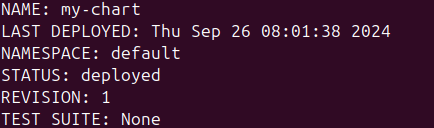
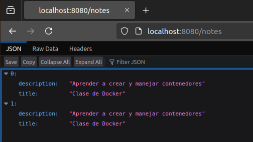
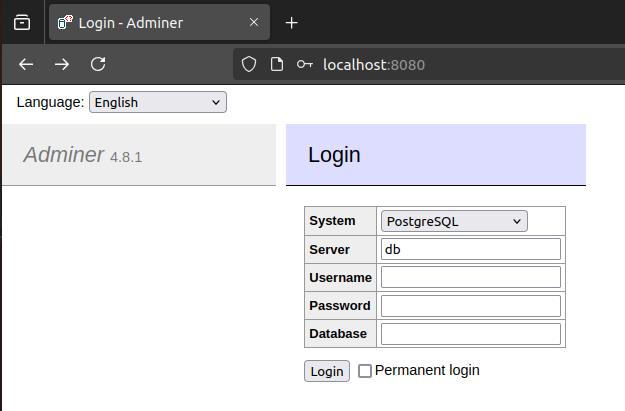
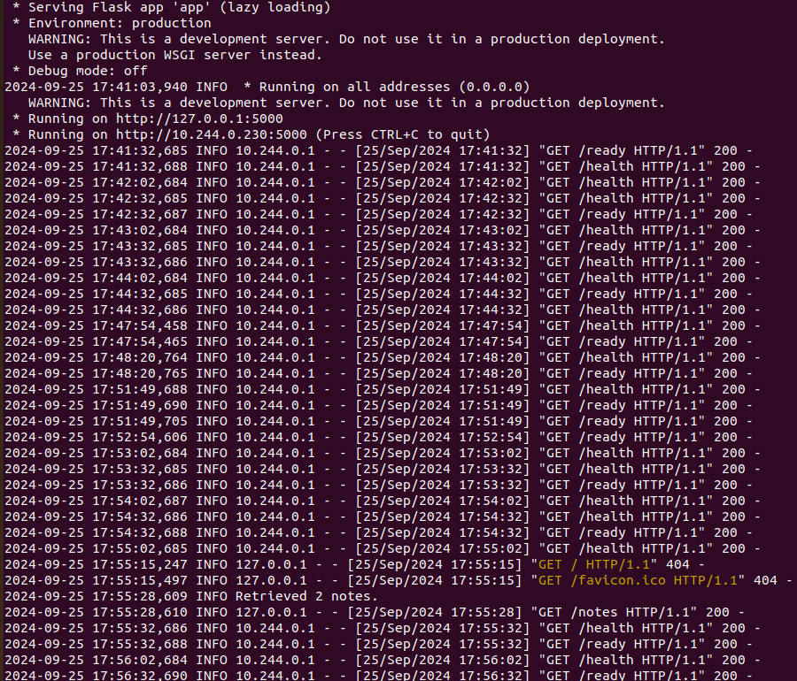
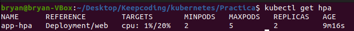
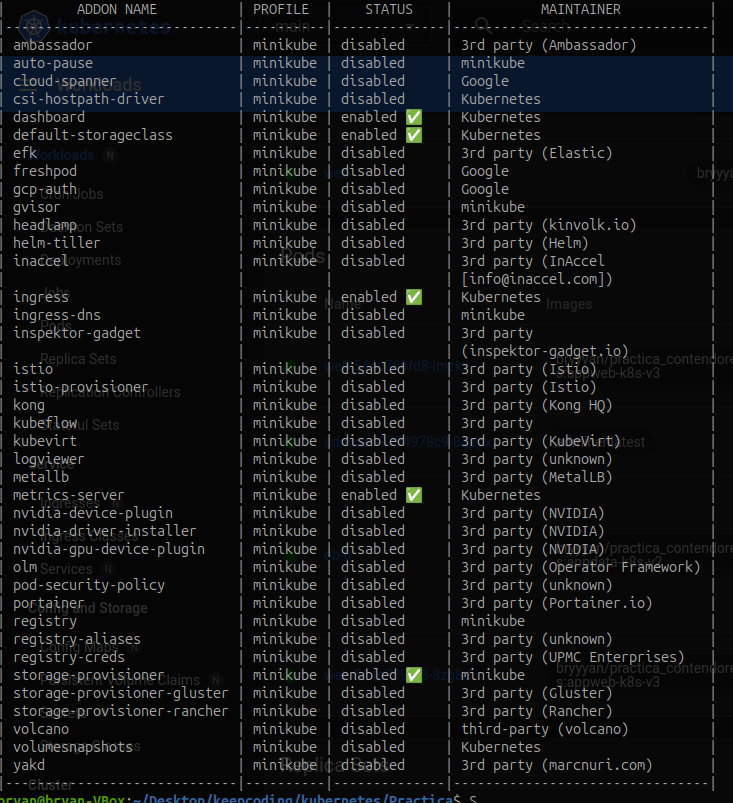
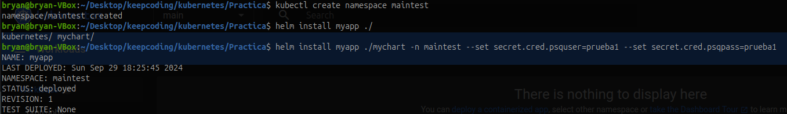
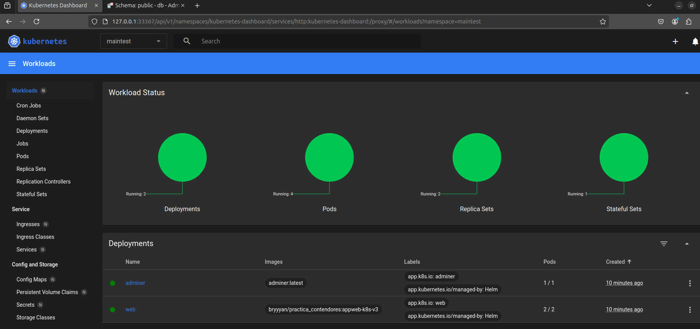
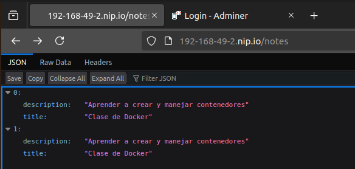
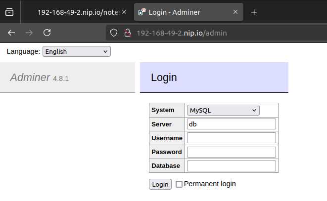

# Práctica: Despliegue de una aplicación en Kubernetes
En esta práctica se ha desarrollado los suguientes puntos:
* [Objetivo General](#objetivo-general)
* [Pasos previos](#pasos-previos)
* [Objetivos específicos](#objetivos-específicos)
  * [Crear un chart de Helm](#crear-un-chart-de-helm)
  * [Configurar la Persistencia de Datos](#configurar-la-persistencia-de-datos)
  * [Gestionar Configuración Sensible](#gestionar-configuración-sensible)
  * [Escalar la Aplicación de manera automática](#escalar-la-aplicación-de-manera-automática)
  * [Exponer la Aplicación al exterior](#exponer-la-aplicación-al-exterior)
  * [Garantizar la resiliencia de la Aplicación](#garantizar-la-resiliencia-de-la-aplicación)
* [Acceso y comprobaciones finales](#acceso-y-comprobaciones-finales)
* [Mejoras futuras](#mejoras-futuras)

## Objetivo General
Desplegar una aplicación con una base de datos en Kubernetes utilizando Helm, asegurando que la aplicación sea accesible, escalable y que los datos se almacenen de forma persistente. La aplicación puede ser pública (e.g. Wordpress) o cualquier otra aplicación que se conecte a una base de datos (e.g. otra aplicación que hayáis desarrollado en otro curso de KeepCoding).  

## Pasos previos
Antes de realizar el despliegue en Kubernetes y Helm hay que tener el cuenta que se debe instalar todos los recursos que se necesitarán:  
- **Docker**: Para instalar Docker, podemos ir a la pagina oficial y proceder con la instalación como se indica `https://docs.docker.com/engine/install/ubuntu/`  
- **Minikube**: Para instalar minikube, podemos ir a la pagina oficial y proceder con la instalación como se indica: `https://minikube.sigs.k8s.io/docs/start/`  
- **Kubectl**: Para instalar Kubectl, podemos ir a la pagina oficial y proceder con la instalación como se indica: `https://kubernetes.io/es/docs/tasks/tools/install-kubectl-linux/`

Teniendo en cuenta lo que se pedirá para el desarrollo del proyecto, se deberá instalar los siguientes addons de minikube:  
- HorizontalPodAutoscaler (HPA) `minikube addons enable metrics-server`  
- Ingress: `minikube addons enable ingress`  
- Para las pruebas con ingress se deberá habilita la opción del tunel `minikube tunel`
## Objetivos específicos
### Crear un chart de Helm 
Para realizar el despliegue se ha usado la estructura basica de Helm, que se describe en el siguiente esquema:
```
mychart/
│
├── Chart.yaml
├── README.md
├── values.yaml
├── charts/
├── img/
└── templates/
    ├── adminer-deployment.yaml
    ├── db-data-persistentvolumeclaim.yaml
    ├── db-statefulset.yaml
    ├── db-secret.yaml
    ├── hub-secret.yaml
    ├── web-persistentvolumeclaim.yaml
    ├── web-deployment.yaml
    ├── web-hpa.yaml
    └── web-service.yaml
```
Para desplegar Helm se hará uso del siguiente comando: `helm install [nombre_despliegue] [directorio chart]`
Obteniendo:  
<p align="center">
    
</p>
  
### Configurar la Persistencia de Datos
Para asegurar los datos de manera persitente se ha usado el manifiesto`persistentvolumeclaim`.  
- **db-data-persistentvolumeclaim**: Asegura los datos almacenados en la base de datos desde `db-staefulset.yaml`.  
- **web-claim0-persistentvolumeclaim**: Asegura los datos almacenados para los logs en  `web-deployment.yaml`.  
Para la base de datos se usa el manifiesto de `statefulset.yaml` puesto que están diseñados específicamente para aplicaciones con estado como bases de datos. Asegura que cada pod tenga un identificador único y un volumen persistente asociado.  
```sh
apiVersion: v1
kind: PersistentVolumeClaim
metadata:
  labels:
    app: {{ .Values.posgre.volumen.name }}
  name: {{ .Values.posgre.volumen.name }}
spec:
  accessModes:
    - ReadWriteOnce
  resources:
    requests:
      storage: {{ .Values.posgre.volumen.storage }}
```  
Para gestionar este manifiesto, se debe modificar el manifiesto de `db-staefulset.yaml` y añadiendo `volumeClaimTemplates`, puesto que este apartado define una plantilla para crear automáticamente PersistentVolumeClaims (PVC) para cada pod.  
```sh
volumeClaimTemplates:          
  - metadata:
      name: postgres-storage
    spec:
      accessModes: ["ReadWriteOnce"]
      resources:
        requests:
          storage: {{ .Values.posgre.volumen.storage }}
```  
Finalmente, se modifica el servicio `db-service.yaml` hay que tener en cuenta que no es `Cluster-IP` asi que se denerá declarar el tipo, para este caso: `clusterIP: None`.  
### Gestionar Configuración Sensible  
Para gestionar la configuración sencible se ha usado el manifiesto de `secret`.  
- **db-secret.yaml**: Almacenan las variables de configuración para la base de datos, se usarán en los deployments de `db-deployment.yaml` y `web-deployment.yaml`.  
- **hub-secret.yaml**: Aalmacenan las variables de configuración para descargar las imagenes del repositorio privado de Docker Hub, que se usarán en los deployments de   `db-deployment.yaml` y `web-deployment.yaml`.  
Se usará la siguiente modelo para administrar los datos sensibles:  
```sh  
apiVersion: v1
kind: Secret
metadata:
  name: {{ .Values.secret.cred.name }}
type: Opaque
data:
  psqdb: {{ .Values.secret.cred.psqdb | b64enc }}
  psqhost: {{ .Values.secret.cred.psqhost | b64enc }}
  psqport: {{ .Values.secret.cred.psqport | b64enc }}
  psqdbname: {{ .Values.secret.cred.psqdbname | b64enc }}
  psquser: {{ .Values.secret.cred.psquser | b64enc }}
  psqpass: {{ .Values.secret.cred.psqpass | b64enc }}  
```  
Para comprabar su funcionamiento previo a la implementación de los recursos necesarios para que la aplicación sea accesible desde fuera del clúster, se ha comprobado redirigiendo los puertos locales al cluster. Para ello se ha usado el siguiente comando:
`kubectl port-forward <pod-name> <local-port>:<pod-port>`  
- Para el caso de la aplicación web:
    `kubectl port-forward services/web-srv 8080:80`   
    Obteniendo:  
    <p align="center">
        
    </p>
- Para el caso de `Adminer`:  
    `ubectl port-forward services/adminer-srv 8080:50`    
    <p align="center">
        
    </p>
### Garantizar la resiliencia de la Aplicación  
Para garantizar la resiliencia de la aplicación se hará uso de los manifiestos de `LivenessProbe` y `readinessProbe`.  
Se ha configurado de la siguiente manera:  
```sh
        # Liveness: verifica si el contenedor está "vivo"
        livenessProbe:
          httpGet:
            path: /health   # Endpoint de salud
            port: {{ .Values.web.deploy.port }}      # El puerto de la aplicación Flask
            scheme: HTTP    # Protocolo HTTP
          initialDelaySeconds: 20  # Espera 20 segundos antes de realizar la primera verificación
          periodSeconds: 30        # Verifica cada 30 segundos
          failureThreshold: 3      # Después de 3 fallos consecutivos, reinicia el contenedor
        # Readiness Probe: Comprueba que la app está lista para recibir tráfico
        readinessProbe:
          httpGet:
            path: /ready    # Endpoint de readiness
            port: {{ .Values.web.deploy.port }}      # El puerto de la aplicación Flask
            scheme: HTTP    # Protocolo HTTP
          initialDelaySeconds: 25   # Espera 25 segundos antes de realizar la primera verificación
          periodSeconds: 60         # Verifica cada 60 segundos
          failureThreshold: 1      # Después de 1 fallo, no dirige tráfico a este contenedor
```
Para comprobar su funcionamiento, se puede ver el los logs, ejecutando el siguiente comando:  
`kubectl logs web-597dbdbd85-2hv6w`  
Obteniedo la siguiente respuesta:  
<p align="center">
    
</p> 

### Escalar la Aplicación de manera automática  
Para realizar la escabilidad se ha usado el manifiesto de `HorizontalPodAutoscaler`. Este manifiesto realizará un escalado horizontal.  
En este apartado se incluye el número minimo de replicas (2) para asegurar que la aplicación siempre esta disponible.  
- **web-hpa.yaml**: Configuración del nñumero de replicas ademas de la limitación de la CPU.  
```sh  
apiVersion: autoscaling/v2
kind: HorizontalPodAutoscaler
metadata:
  name: {{ .Values.Load.name }}
spec:
  maxReplicas: {{ .Values.Load.spec.maxrep }} #numero maximo de replicas
  metrics:
  - resource:
      name: cpu
      target:
        averageUtilization: {{ .Values.Load.resource.avrcpu }} # Modificar el porcentaje de utilizacion de CPU
        type: Utilization
    type: Resource
  minReplicas: {{ .Values.Load.spec.minrep }}
  # Apunta al deployment de la web
  scaleTargetRef:
    apiVersion: {{ .Values.web.deploy.apiver }} #apps/v1
    kind: Deployment
    name: {{ .Values.web.deploy.name }} 
```  
Para realizar las pruebas se ha hecho de la siguiente manera:    
- Comprobar que se esta ejecutando: `kubectl get hpa -w`   
<p align="center">
    
</p>  
- Aumentar la carga de trabajo para verificar el autoescalado:   

kubectl run load-generator-manual --image=busybox --command -- sh -c 'while true; do wget -q -O- http://nginx-hpa   >dev/null 2>&1; done'

### Exponer la Aplicación al exterior  
Para poder exponer la aplicación al exterior se usará manifiesto del tipo `Ingress` el cual llamamos `web-ingress.yaml`.  
La configuración es la siguiente:
```sh
apiVersion: networking.k8s.io/v1
kind: Ingress
metadata:
  name: {{ .Values.Ingress.name }}
spec:
  rules:
  - host: {{ .Values.Ingress.host }} 
    http:
      paths:
      - path: /notes
        pathType: Prefix
        backend:
          service:
            name: {{ .Values.web.service.name }} 
            port:
              number: {{ .Values.web.service.targetport }} 
      - path: /admin
        pathType: Prefix
        backend:
          service:
            name: {{ .Values.adminer.service.name }} 
            port:
              number: {{ .Values.adminer.service.targetport }}    
```
De esta manera se expone la aplicación al exterior del clúster.
## Acceso y comprobaciones finales.
Una vez se ha comprobado el correcto funcionamiento de las distintas partes, continuamos con las comprobaciones finales de l conjunto. Para ello se deberá:
- Comprobar que los addons antes mencionados están habilitado, para ello se ejecutará el comando `minikube addons list`  
<p align="center">
    
</p>

- Habilitar el tunel de minikube: `minikube tunel`.    
- Finalmente, para evitar posible configuraciones previas, se crea un nuevo namespace:  
`kubectl create namespace maintest`.  

Una vez se ha comptabado que lo que necesitamos esta habilitado, continuamos con la ejecución del chart de Helm.  
- Para desplegar Helm ejecutamos el siguiente comando:  
`helm install myapp ./mychart -n maintest --set secret.cred.psquser=prueba1 --set secret.cred.psqpass=prueba1`  

<p align="center">
    
</p> 

Para revisar que el despliegue se ejecute correctamente debemos ejecutar los siguiente comandos para comprobar que no exiten errores:
```sh
kubectl -n maintest get pods  
kubectl -n maintest get services  
kubectl -n maintest get persistentvolumeclaims   
kubectl -n maintest get horizontalpodautoscalers.autoscaling  
```
Otro modo mas visual de monitorear los procesos sería habilitando el addons de `dashboard`: `minikube addons dashboard`.   
<p align="center">
    
</p>

- Para añadir contenido a la aplicacion Flask se usará una petición `POST` como por ejemplo:  
  ```sh   
  curl -X POST http://192-168-49-2.nip.io/notes \
  -H "Content-Type: application/json" \
  -d '{"title":"Prueba","description":"Desde curl"}'
  
  ```  
  También se puede visualizar los datos usando una petición `GET`:
  ```sh
  curl -X GET http://192-168-49-2.nip.io/notes
  ```
- Para poder acceder a la aplicación se deberá hacer de la siguiente manera:  
    
  * La aplicación principal:  
    `http://192-168-49-2.nip.io/notes`  

    <p align="center">
        
    </p>


  * Redirección a la monitorización de DDBB      
    `http://192-168-49-2.nip.io/admin`  

    <p align="center">
        
    </p>
## Mejoras futuras
- Implementar un control de fallos en la aplicación principal, de este modo se podría comprobar el correcto funcionamiento haciendo una llamada `POST` a la aplicación principal y forzar un "fallo" para poder comprobar mejor la reciliencia de la aplicación.  
- Encriptar los datos sencibles para mayor seguridad con el uso de `Sops` u otro encriptador que sea compatible con Helm.
- Gestión de logs.  
- Configura la replicación de la base de datos (por ejemplo, con PostgreSQL streaming replication) para mantener una copia redundante de los datos en un segundo servidor.  
- Utiliza un sistema de backup para tomar snapshots regulares del volumen persistente.  
  
