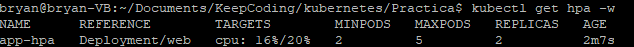
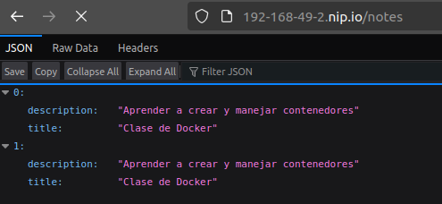
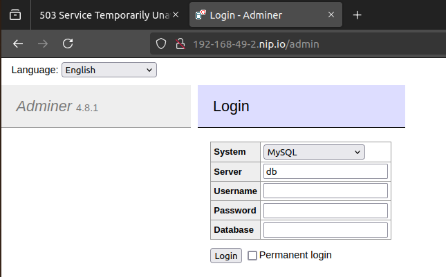

# Práctica: Despliegue de una aplicación en Kubernetes    
## Configurar la Persistencia de Datos  
Para asegurar la persistencia de los datos de la base de datos, se ha realizado un `persistentvolumenclaim` junto con un `deployment` pero se ha reemplazado el `Deployment` por un `StatefulSet`.
La ventaja del StatefulSet es que permite crear PVCs dinámicamente mediante `volumeClaimTemplates`, evitando la necesidad de definir un PersistentVolumeClaim manual.
Cada réplica del StatefulSet obtiene su propio volumen persistente con nombre único, asegurando que los datos no se pierdan incluso si el Pod se elimina o reinicia.

Implementación:
- `db StatefulSet`: define volumeClaimTemplates, lo que genera automáticamente un PVC (por ejemplo, db-data-db-0).

- `web-claim0-persistentvolumeclaim`: se mantiene para la aplicación web (almacena logs).  
```  
apiVersion: v1  
kind: PersistentVolumeClaim  
metadata:  
  labels:  
    app.k8s.io: db-data  
  name: db-data  
spec:  
  accessModes:  
    - ReadWriteOnce  
  resources:  
    requests:  
      storage: 100Mi  
```  
## Gestionar Configuración Sensible  
Para gestionar la configuración sencible se ha usado el manifiesto de `secret`.  
- **db-secret.yaml**: Almacenan las variables de configuración para la base de datos, se usarán en los deployments de `db-deployment.yaml` y `web-deployment.yaml`.  
- **hub-secret.yaml**: Aalmacenan las variables de configuración para descargar las imagenes del repositorio privado de Docker Hub, que se usarán en los deployments de   `db-deployment.yaml` y `web-deployment.yaml`.  
Se usará la siguiente modelo para administrar los datos sensibles:  
```  
apiVersion: v1  
kind: Secret  
metadata:  
  labels:  
    app.k8s.io: db-cred  
  name: db-cred  
type: Opaque  
data:  
  DB_HOST: secret  
  DB_PASS: secret  
  POSTGRES_DB: secret  
```  
Finalemte para administrar los datos no sensibles se ha usado el manifiesto de `configmap`.  
- **env-test1-env-configmap.yaml**: Almacena las variables de configuración no criticas (contraseñas) para la base de datos, se usarán en los deployments de `db-deployment.  yaml` y `web-deployment.yaml`.  
Se usará el siguiente modelo:  
```  
apiVersion: v1  
data:  
  DB_NAME: name  
  DB_PORT: port  
  DB_USER: user  
kind: ConfigMap  
metadata:  
  labels:  
    app.k8s.io: db-env-test1-env  
  name: env-test1-env  
```  
## Escalar la Aplicación de manera automática  
Para realizar la escabilidad se ha usado el manifiesto de `HorizontalPodAutoscaler`. Este manifiesto realizará un escalado horizontal.  
- **web-hpa.yaml**: Configuración del nñumero de replicas ademas de la limitación de la CPU.  
```  
apiVersion: autoscaling/v2  
kind: HorizontalPodAutoscaler  
metadata:  
  name: app-hpa  
spec:  
  maxReplicas: 5 #numero maximo de replicas  
  metrics:  
  - resource:  
      name: cpu  
      target:  
        averageUtilization: 20 # Modificar el porcentaje de utilizacion de CPU  
        type: Utilization  
    type: Resource  
  minReplicas: 2  
  scaleTargetRef:  
    apiVersion: apps/v1  
    kind: Deployment  
    name: web   
```  
Para realizar las pruebas se ha hecho de la siguiente manera:  
  
- Comporbar que esta habilitado el servicio de metrics `minikube addons enable metrics-server`   
- Comprobar que se esta ejecutando: `kubectl get hpa -w`   
      
- Aumentar la carga de trabajo para verificar el autoescalado `kubectl run load-generator-manual --image=busybox --command -- sh -c 'while true; do wget -q -O- http://nginx-hpa   >dev/null 2>&1; done'`  
## Exponer la Aplicación al exterior  
Para poder exponer la aplicación al exterior se usará manifiesto del tipo `Ingress` el cual llamamos `web-ingress.yaml`.  
La configuración es la siguiente:
```
apiVersion: networking.k8s.io/v1
kind: Ingress
metadata:
  #labels:
  #  app.k8s.io: web
  name: web-igrss
  namespace: default
spec:
  rules:
  - host: 192-168-49-2.nip.io # Se usa la IP de minikube tunel
    http:
      paths:
      - path: /notes
        pathType: Prefix
        backend:
          service:
            name: web-srv # Nombre del servicio web
            port:
              number: 80
      - path: /admin
        pathType: Prefix
        backend:
          service:
            name: adminer-srv # Nombre del servicio de adminer
            port:
              number: 50    
```
De esta manera se expone la aplicación al exterior, debido al funcionamiento de la aplicación se puede usar los siguientes comandos:  
- Para añadir contenido a la aplicacion Flask se usará la siguiente petición:  
  ```   
  curl -X POST -H "Content-Type: application/json" -d '{"title":"Clase de Docker", "description":"Aprender a crear y manejar contenedores"}' http://192-168-49-2.nip.io:5000/notes  
  ```  
- Para poder acceder a la aplicación se deberá hacer de la siguiente manera:  
    
  * La aplicación principal:  
    `http://192-168-49-2.nip.io/notes`  
        
  * Redirección a la monitorización de DDBB    
    `http://192-168-49-2.nip.io/admin`  
      
  * Para añadir notas:  
    `curl -X POST -H "Content-Type: application/json" -d '{"title":"Clase de Docker", "description":"Aprender a crear y manejar contenedores"}' http://192-168-49-2.nip.io/notes`  

### Garantizar la resiliencia de la Aplicación  
Para garantizar la resiliencia de la aplicación se hará uso de los manifiestos de `LivenessProbe` y `readinessProbe`.  
Se ha configurado de la siguiente manera:
```
        # Liveness: verifica si el contenedor está "vivo"
        livenessProbe:
          httpGet:
            path: /health   # Endpoint de salud
            port: 5000      # El puerto de la aplicación Flask
            scheme: HTTP    # Protocolo HTTP
          initialDelaySeconds: 20  # Espera 20 segundos antes de realizar la primera verificación
          periodSeconds: 30        # Verifica cada 30 segundos
          failureThreshold: 3      # Después de 3 fallos consecutivos, reinicia el contenedor
        # Readiness Probe: Comprueba que la app está lista para recibir tráfico
        readinessProbe:
          httpGet:
            path: /ready    # Endpoint de readiness
            port: 5000      # El puerto de la aplicación Flask
            scheme: HTTP    # Protocolo HTTP
          initialDelaySeconds: 25   # Espera 25 segundos antes de realizar la primera verificación
          periodSeconds: 60         # Verifica cada 60 segundos
          failureThreshold: 1      # Después de 1 fallo, no dirige tráfico a este contenedor 
```
### Pruebas de resiliencia de la aplicación
Para poder realizar las pruebas de la resiliencia de la aplicación, se ha modificado la imagen web para añadir las funcionalidades de verificación en el código, de modo que se ha añadido los siguientes campos:
- Simular fallo en el estado /health  
  `curl -X POST http://192-168-49-2.nip.io/set_health/unhealthy`  
- Restaurar el estado /health  
  `curl -X POST http://192-168-49-2.nip.io/set_health/healthy`  
- Simular fallo en el estado /ready  
  `curl -X POST http://192-168-49-2.nip.io/set_ready/notready`  
- Restaurar el estado /health  
  `curl -X POST http://192-168-49-2.nip.io/set_ready/ready`  


