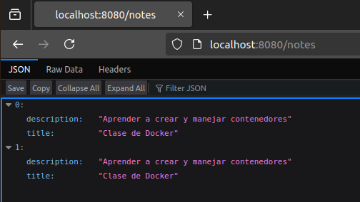
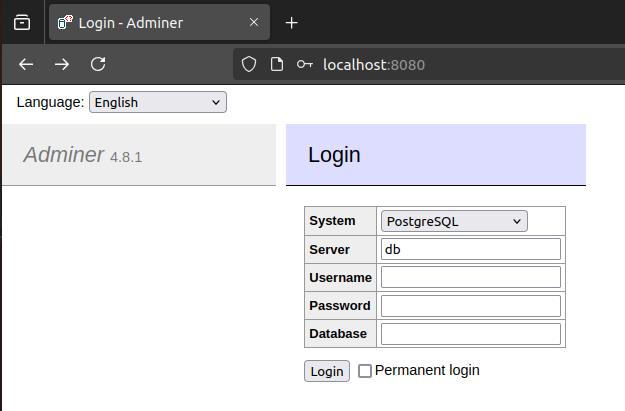
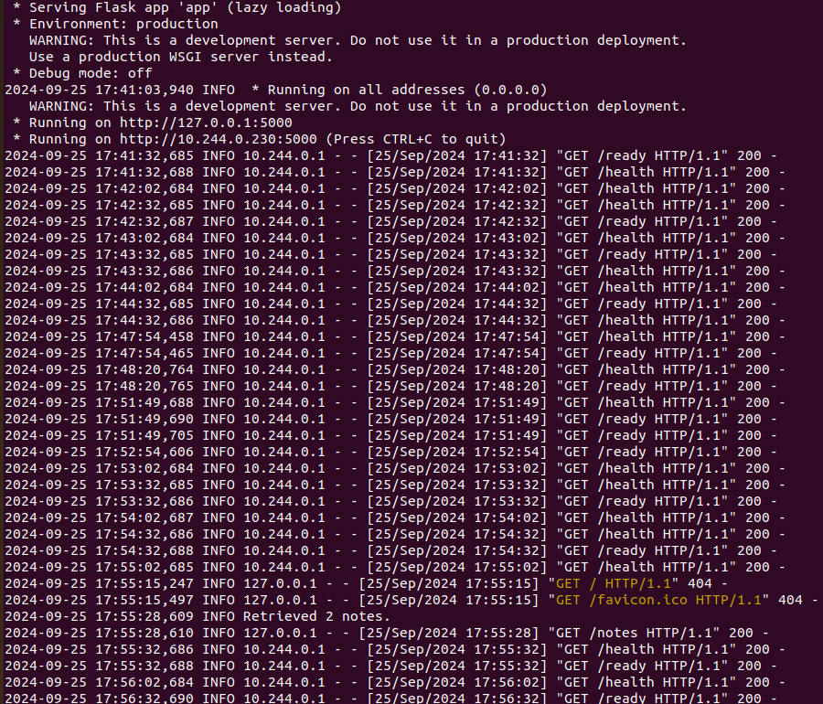

# Práctica: Despliegue de una aplicación en Kubernetes
## Objetivo General
Desplegar una aplicación con una base de datos en Kubernetes utilizando Helm, asegurando que la aplicación sea accesible, escalable y que los datos se almacenen de forma persistente. La aplicación puede ser pública (e.g. Wordpress) o cualquier otra aplicación que se conecte a una base de datos (e.g. otra aplicación que hayáis desarrollado en otro curso de KeepCoding).  

## Pasos previos
Antes de realizar el despliegue en Kubernetes y Helm hay que tener el cuenta que se debe instalar todos los recursos que se necesitarán:  
- **Docker**: Para instalar Docker, podemos ir a la pagina oficial y proceder con la instalación como se indica `https://docs.docker.com/engine/install/ubuntu/`  
- **Minikube**: Para instalar minikube, podemos ir a la pagina oficial y proceder con la instalación como se indica: `https://minikube.sigs.k8s.io/docs/start/`  
- **Kubectl**: Para instalar Kubectl, podemos ir a la pagina oficial y proceder con la instalación como se indica: `https://kubernetes.io/es/docs/tasks/tools/install-kubectl-linux/`

Teniendo en cuenta lo que se pedirá para el desarrollo del proyecto, se deberá instalar los siguientes addons de minikube:  
- HorizontalPodAutoscaler (HPA)  
```
Instalar Metrics Server:
kubectl apply -f https://github.com/kubernetes-sigs/metrics-server/releases/latest/download/components.yaml
Verifica que el Metrics Server esté funcionando:
kubectl get apiservices | grep metrics
```  
- Ingress  
```
Instalar NGINX Ingress Controller
kubectl apply -f https://raw.githubusercontent.com/kubernetes/ingress-nginx/main/deploy/static/provider/cloud/deploy.yaml
Verificar que este funcionado:
kubectl get pods -n ingress-nginx
Habilitar el addon de minikube:
minikube addons enable ingress
```  
Quedaría ejecutar eñ tunel de minikube y acceder al `LoadBalancer`, con el siguiente comando: `minikube tunnel`
## Objetivos específicos
### Crear un chart de Helm 
Para realizar el despliegue se ha usado la estructura basica de Helm, que se describe en el siguiente esquema:
```
mychart/
│
├── Chart.yaml
├── README.md
├── values.yaml
└── templates/
    ├── adminer-deployment.yaml
    ├── adminer-service.yaml
    ├── db-data-persistentvolumeclaim.yaml
    ├── db-deployment.yaml
    ├── db-secret.yaml
    ├── db-service.yaml
    ├── hub-secret.yaml
    ├── web-claim0-persistentvolumeclaim.yaml
    ├── web-deployment.yaml
    └── web-service.yaml

```
### Configurar la Persistencia de Datos
Para asegurar los datos de manera persitente se ha usado el manifiesto`persistentvolumeclaim`.  
- **db-data-persistentvolumeclaim**: Asegura los datos almacenados en la base de datos desde `db-deployment.yaml`.  
- **web-claim0-persistentvolumeclaim**: Asegura los datos almacenados para los logs en  `web-deployment.yaml`.  
La implementacón es similar en ambos casos, aunque la diferenca esta en la llamada. Se usó esta base de código: 
```
apiVersion: v1
kind: PersistentVolumeClaim
metadata:
  labels:
    app.k8s.io: {{ .Values.posgre.volumen.name }}
  name: {{ .Values.posgre.volumen.name }}
spec:
  accessModes:
    - ReadWriteOnce
  resources:
    requests:
      storage: {{ .Values.posgre.volumen.storage }}
```
## Gestionar Configuración Sensible  
Para gestionar la configuración sencible se ha usado el manifiesto de `secret`.  
- **db-secret.yaml**: Almacenan las variables de configuración para la base de datos, se usarán en los deployments de `db-deployment.yaml` y `web-deployment.yaml`.  
- **hub-secret.yaml**: Aalmacenan las variables de configuración para descargar las imagenes del repositorio privado de Docker Hub, que se usarán en los deployments de   `db-deployment.yaml` y `web-deployment.yaml`.  
Se usará la siguiente modelo para administrar los datos sensibles:  
```  
apiVersion: v1
kind: Secret
metadata:
  name: {{ .Values.secret.cred.name }}
type: Opaque
data:
  psqdb: {{ .Values.secret.cred.psqdb | b64enc }}
  psqhost: {{ .Values.secret.cred.psqhost | b64enc }}
  psqport: {{ .Values.secret.cred.psqport | b64enc }}
  psqdbname: {{ .Values.secret.cred.psqdbname | b64enc }}
  psquser: {{ .Values.secret.cred.psquser | b64enc }}
  psqpass: {{ .Values.secret.cred.psqpass | b64enc }}  
```  
Para comprabar su funcionamiento previo a la implementación de los recursos necesarios para que la aplicación sea accesible desde fuera del clúster, se ha comprobado redirigiendo los puertos locales al cluster. Para ello se ha usado el siguiente comando:
`kubectl port-forward <pod-name> <local-port>:<pod-port>`  
- Para el caso de la aplicación web:
    `kubectl port-forward services/web-srv 8080:80`   
    Obteniendo:  
    <p align="center">
        
    </p>
- Para el caso de `Adminer`:  
    `ubectl port-forward services/adminer-srv 8080:50`    
    <p align="center">
        
    </p>
### Garantizar la resiliencia de la Aplicación  
Para garantizar la resiliencia de la aplicación se hará uso de los manifiestos de `LivenessProbe` y `readinessProbe`.  
Se ha configurado de la siguiente manera:  
```
        # Liveness: verifica si el contenedor está "vivo"
        livenessProbe:
          httpGet:
            path: /health   # Endpoint de salud
            port: {{ .Values.web.deploy.port }}      # El puerto de la aplicación Flask
            scheme: HTTP    # Protocolo HTTP
          initialDelaySeconds: 20  # Espera 20 segundos antes de realizar la primera verificación
          periodSeconds: 30        # Verifica cada 30 segundos
          failureThreshold: 3      # Después de 3 fallos consecutivos, reinicia el contenedor
        # Readiness Probe: Comprueba que la app está lista para recibir tráfico
        readinessProbe:
          httpGet:
            path: /ready    # Endpoint de readiness
            port: {{ .Values.web.deploy.port }}      # El puerto de la aplicación Flask
            scheme: HTTP    # Protocolo HTTP
          initialDelaySeconds: 25   # Espera 25 segundos antes de realizar la primera verificación
          periodSeconds: 60         # Verifica cada 60 segundos
          failureThreshold: 1      # Después de 1 fallo, no dirige tráfico a este contenedor
```
Para comprobar su funcionamiento, se puede ver el los logs, ejecutando el siguiente comando:  
`kubectl logs web-597dbdbd85-2hv6w`  
Obteniedo la siguiente respuesta:  
<p align="center">
    
</p>  
  
